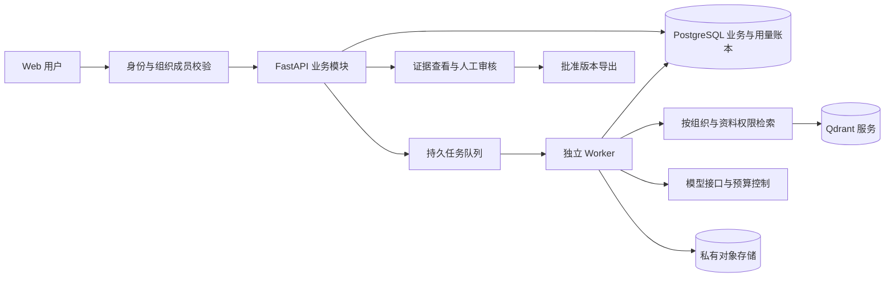

# 知源：从求职作品到 AI SaaS 的研究与实施路线

调研日期：2026-09-19。适用阶段：先形成可展示、可讲解的工程作品，再根据实际客户条件寻找有边界的试点。本文是产品与研发建议，**不表示建议功能已实现，也不表示已经验证需求、收入或生产能力**。

本次核查了 8 个 GitHub 仓库、6 个主流平台及中国官方规则，并重新阅读当前项目的 README、验收记录与关键接口。没有安装上述开源平台、采购服务、联系客户或部署公网服务。本次新增研究文档，不改业务代码；已有测试结果来自本项目此前的本地验收，本次没有重新运行。

## 1. 推荐决策

**继续现有项目，下一版定位为“小型技术产品团队的知识与内容协作系统”。先完成“产品资料 → 有依据的 FAQ／售前草稿 → 审核 → 导出 → 资料变更后提示复核”的业务闭环。**

这是结合现有代码、求职紧迫性和有限获客渠道作出的判断，仍需真实用户验证。第一阶段可称“可演示的 SaaS 原型”，通过真实部署与试点后再讨论商业版本。

- 保留 React、FastAPI、现有检索与审核流程，补足组织、权限、资料版本、可靠任务及用量管理。
- RAG 是产品的知识能力；Obsidian／Markdown 是资料入口，后续按需求做单向同步。现在不同时重做笔记编辑器、插件市场和双向同步冲突处理。
- BOSS 岗位对照、学习路线和项目验收作为求职说明；试点企业默认看到业务工作台。
- 当前已有本地作品即可开始求职。下一阶段边补强、边练习解释与修改代码，不等支付、私有化和全渠道发布完成后才投递。

| 候选方向 | 当前能复用什么 | 最需要验证的疑问 | 建议顺序 |
| --- | --- | --- | --- |
| 技术产品资料 → 售前／营销草稿 | 知识库、来源引用、草稿、审核、导出 | 多型号、频繁更新是否真的造成反复核对和返工？谁负责批准？ | 首选，用一套明确标注的演示产品资料完成作品 |
| 代运营团队的客户资料与审稿 | 内容生成、卡片、审核历史 | 是否有稳定审稿量？风格定制和人工服务是否吞掉收益？ | 有相应试点来源时可切换，不同时经营两个方向 |
| 弱网现场维修知识助手 | 少量检索能力 | 现场资料、设备责任、离线推理和终端交付是否可获得？ | 暂缓；当前缺客户资料与现场条件 |
| 个人 Obsidian AI 知识库 | Markdown 导入、中文检索 | 用户为什么不使用已有笔记工具与插件？是否持续付费？ | 保留个人入口与演示，不另起完整产品线 |

上述排序不是市场规模或成功概率排名；没有客户访谈数据支持数值打分。

## 2. 商业化趋势：事实与推断分开

### 主流平台在卖什么

| 官方平台 | 已核实的产品／收费方向 | 对知源的启示 |
| --- | --- | --- |
| [Microsoft Copilot Studio](https://www.microsoft.com/licensing/guidance/Microsoft-Copilot-Studio) | 企业资料与工具连接；Credits 容量与按量计费，既有办公许可影响权益 | 接入工作环境、身份和预算是产品组成部分 |
| [Salesforce Agentforce](https://www.salesforce.com/agentforce/pricing/) | CRM 中的业务动作、会话、员工使用等计费方式 | 让 AI 完成可检查的业务步骤，比展示一段回答更容易说明价值 |
| [Intercom Fin](https://www.intercom.com/help/en/articles/8205718-fin-ai-agent-outcomes) | 按明确定义的解决、转接或线索筛选结果计费 | 结果必须有定义、计量和撤销规则；生成成功不能直接算业务成功 |
| [阿里云百炼](https://docs.agent.bailian.aliyun.com/zh/rag/settings/billing) | 知识库资源与模型等分别计费 | 基础能力可以采购；资料整理、质量控制、权限与维护仍需交付 |
| [扣子](https://docs.coze.cn/coze_pro_premium_package) | 订阅、积分、组织协作与用量管理 | 小团队已有低门槛替代品；单纯“调用国产模型”不足以形成差异 |
| [飞书 AI／aily](https://www.feishu.cn/content/article/7631864469689240764) | 利用已有知识与协作数据，支持知识更新和应用迭代 | 新产品必须解释为什么值得增加一个入口和资料维护负担 |

详细报价、币种、适用条件与读取限制见 [平台调研记录](research/2026-09-19/platform-notes.md)。价格是查询时可读版本，不是中国客户采购报价。飞书新版完整现价未核验。

[McKinsey 2026 年 AI 调查](https://www.mckinsey.com/capabilities/quantumblack/our-insights/the-state-of-ai)于 2026-08-25 发布，调查来自 97 个国家的 1,719 名受访者：44% 报告企业正在扩大 AI 应用；32% 曾因可以自行构建而放弃购买某些软件产品或功能。它提示“企业扩大应用”与“简单软件更难卖”可以同时发生。该样本是全球企业自报调查，不能推算深圳小企业采购比例。

**本报告的推断：** 商业机会更可能来自持续维护可靠资料、减少审核返工、接入现有协作和控制成本，而非仅提供聊天或工作流画布。这个判断不等于目标客户已经愿意付费。

中国本地也已有直接竞争：[腾讯元器官方介绍](https://yuanqi.tencent.com/guide/yuanqi-introduction)提供知识库、工作流与微信生态渠道能力。若客户用现成平台加一份共享文档就足够，知源应保留为求职作品，不能仅凭增加功能认定有商业机会。

[深圳 2026—2028 年人工智能与应用发展行动计划](https://gxj.sz.gov.cn/gkmlpt/content/12/12967/post_12967724.html)强调应用导向；这可支持寻找产业应用试点的方向，但不证明本项目有采购订单，也不能推断补贴资格。

## 3. GitHub 参考：学模块，先核许可

| 项目 | 优先借鉴 | 当前许可／交付注意点 |
| --- | --- | --- |
| [Dify](https://github.com/langgenius/dify) | 工作流步骤、失败原因和运行页面 | 修改版 Apache 条款，多租户与前端品牌受附加限制 |
| [FastGPT](https://github.com/labring/FastGPT) | 分段预览、检索调试、知识评测 | Apache 附加条款限制相似多租户 SaaS 和品牌修改；README 表述需一起核对 |
| [RAGFlow](https://github.com/infiniflow/ragflow) | 文档解析、分块到引用的追溯 | 根许可 Apache 2.0；依赖及模型另查，官方最低 16 GB 内存，不适合当前 8 GB 机器整套部署 |
| [Onyx](https://github.com/onyx-dot-app/onyx) | 文档连接器、权限传播 | 普通代码 MIT，企业目录另有商业条件；不能把全部企业功能当免费能力 |
| [n8n](https://github.com/n8n-io/n8n) | 连接器契约、执行历史、重试 | Sustainable Use License；内部或部分后台用途与收费白标托管不同，后者需商业授权 |
| [Langfuse](https://github.com/langfuse/langfuse) | 运行追踪、提示词版本、评测与成本 | 普通代码 MIT，EE 目录例外；先借鉴数据模型，按需要接平台 |
| [Logto](https://github.com/logto-io/logto) | 身份认证、组织成员与角色 | 本次查到当前 MPL 2.0；集成身份服务仍需自行实现业务授权 |
| [Postiz](https://github.com/gitroomhq/postiz-app) | 草稿、排期与发布回执 | AGPL；商业收费不等于可任意闭源提供修改版网络服务；国内平台权限仍需另取得 |

许可证原文、固定提交和检查范围见 [GitHub 研究记录](research/2026-09-19/github-notes.md)。**源码可见不能代替 SaaS 商业授权判断。** 当前建议保留自身项目，优先参考 Logto 的组织模型、Langfuse 的运行记录、Dify／FastGPT 的操作体验，不引入整套重型平台。

## 4. 把特殊需求落实为可演示的任务

首个演示对象可设为一支销售工业传感器的虚构小团队。全部型号、参数、案例明确标为演示资料，不冒充真实客户。买方假设是产品、市场或销售负责人；使用者是需要查资料和准备答复的员工。

### 一次任务的完整过程

1. 管理员导入型号资料、参数表、已批准 FAQ 和保修条款；为资料记录负责人、型号、版本、生效时间及状态。
2. 员工选择产品和“生成售前 FAQ”，填写客户问题。首版只完成这一种任务模板。
3. 系统先选正确型号与有效版本，检索证据，列出缺失项，再生成草稿。参数、单位和保修期由结构化事实校验，引用可打开原段落。
4. 审核人查看证据、修改内容、通过或退回。修改已批准内容应重新审核。
5. 导出本次批准的内容与版本记录；发布渠道由员工操作，首版不自动对外作出承诺。
6. 当新版资料把保修期从 24 个月改为 12 个月时，旧来源标为失效，系统找出使用旧版本的草稿，提示复核；历史记录仍保留原事实与审批过程。

报价、库存和交期如果没有可信、及时的数据源，就显示“待人工确认”，不能从相似资料补造。引用存在也不等于内容正确，需要核对引用是否真正支持每个关键事实。

### 人群、环境与验收

| 人群／环境 | 具体问题假设 | 产品设计 | 可以验证什么 |
| --- | --- | --- | --- |
| 新入职销售、非技术运营 | 不会写复杂提示词，不熟悉产品边界 | 中文任务表单、示例、缺资料提示、来源解释 | 用户无需培训提示词，能完成一次任务并找到参数依据 |
| 一人兼多职的小团队 | 没时间反复核对参数和找旧稿 | 固定模板、事实卡、修改对比和审核待办 | 同一任务的审核完成时间与返工次数 |
| 多品牌／多客户服务团队 | 不同客户资料和风格容易混用 | 组织及项目权限；检索、缓存、导出都隔离 | A 客户无法用文档 ID、搜索、历史记录或链接取得 B 客户资料 |
| 国内网络、预算有限 | 依赖海外资源导致加载不稳，调用成本不可控 | 前端资源本地构建；可配置境内服务；队列、超时、预算上限 | 网络异常可见、重试受控；用户能预知任务额度 |
| 涉及商业秘密的团队 | 不清楚数据会发给谁、保存多久 | 数据流说明、授权资料范围、模型白名单、脱敏及删除策略 | 从文档到模型、日志与备份的去向可以核对 |
| 使用屏幕阅读器、视力较弱或不便使用鼠标的用户 | 小字、只用颜色标状态、操作无法聚焦 | 键盘操作、可读标签、字号缩放、状态文字与清晰错误提示 | 用键盘和读屏完成导入、审核等核心操作 |

无障碍设计参考 [W3C WCAG 2.2](https://www.w3.org/WAI/standards-guidelines/wcag/glance/)，不表示已完成一致性认证。特殊人群的实际需要应在对应用户参与下验证。现阶段不另外扩张到医疗建议、金融决策或未成年人教育等责任更复杂的产品。

## 5. 当前基础与真正缺口

本次重新阅读 [README](../README.md)、[验收记录](validation/acceptance.md)、[工作区边界代码](../backend/app/agent_core/boundaries.py)和 [任务接口](../backend/app/api/routes/agent_runs.py)。结论如下：

| 层面 | 当前证据 | SaaS 仍需完成 |
| --- | --- | --- |
| 检索与生成 | 中文真实向量、Qdrant 本地持久化、来源引用；曾实际调用 DeepSeek | 模型／切块版本、复杂文档、独立评测集、有效资料选择与权限检索 |
| 审核 | 通过、退回、编辑撤销批准、审核快照和失效引用检查 | 审核人的可信身份与权限、资料版本变更的影响追踪 |
| 工作区 | 有分组字段与部分查询过滤；actor 默认为 local_user | 用户、成员关系、服务端授权；请求携带 workspace_id 不等于有权访问 |
| 旧内容模块 | 草稿、卡片、来源、任务和日志仍有本地使用接口 | 全部接口、搜索和导出纳入组织权限，不能只保护新增知识库 |
| 任务 | 进程内后台执行、SQL 步骤记录、原子领取与防重复重试、重启识别中断及用户显式续跑 | 独立持久队列、多 Worker 租约与故障接管；外部模型调用仍可能重复产生费用 |
| 用量 | 模型日志已有部分 token／耗时 | 按组织的用量账本、预算预留与结算、套餐和对账 |
| 部署 | 单用户、默认本机监听；提供 Docker／CI 文件 | 真实构建与部署验证、监控、备份恢复、密钥与运维流程 |

现有验收记录有 120 项测试和真实模型链路；12 道人工开发题中存在 1 道误拒答。这些证据支持本地作品展示，不能用作生产正确率、租户隔离或并发能力的证明。

## 6. 建议架构：保持单体应用，分离长任务

这是目标方案，不是当前运行架构。保留本地轻量模式；服务器演示环境按阶段引入基础服务，避免让 8 GB 开发机同时承担多个大型平台。

| 模块 | 推荐实施方式 | 核心验收 |
| --- | --- | --- |
| 身份与组织 | 接成熟身份服务／库；增加 Organization、Membership、Role。先设负责人、编辑、审核、只读等必要角色 | 撤销成员立即影响访问；修改请求中组织 ID 不能越权；普通用户不能给自己提权 |
| 全链路权限 | 从已验证身份与成员关系建立组织上下文；SQL、检索、缓存键、对象路径、队列和日志统一使用 | A／B 两组织共享相似型号数据，各类读取、修改、检索、导出及签名链接负例均通过 |
| 业务存储 | PostgreSQL＋迁移工具，迁移现有本地数据前备份；保留 Qdrant，部署时转独立服务 | 迁移可回滚；数据恢复演练有记录。暂不同时增加第二套向量库 |
| 文件与资料 | 私有 OSS／COS 等对象存储，授权下载、大小／类型限制；DocumentVersion、Fact、SourceRef | 引用锁定原文版本；删除覆盖索引与对象，备份中的保留和恢复规则可说明 |
| 异步任务 | Redis＋Celery 作为可选首个实现，沿用 SQL 状态；明确任务尝试、租约、幂等键和重试上限 | 同一任务重复派发不重复创建结果；Worker 中断后可恢复；外部模型费用如有重复实际发生要记录 |
| AI 质量 | 固定型号与版本过滤；按评测需要增加中文混合检索／重排；优先支持一种常见 PDF／表格结构 | 数值、单位、过期资料、缺失信息、跨组织、恶意文档指令均有独立样本 |
| 成本与额度 | UsageEvent／Ledger；区分业务任务、模型尝试与用户扣费。预留额度，执行后结算，失败按明确规则处理 | 并发请求不能绕过限额；重试不重复扣用户额度；成本未知与估算均标注 |
| 追踪与运营 | 关联 request、run、step、模型、提示词和资料版本；默认收敛原文日志 | 失败可以定位；日志不泄漏其他组织内容和凭证；管理员操作留审计记录 |

检索过滤必须发生在组织允许的候选数据范围内，不能先全库取回再让模型自行忽略。资料中的指令视为内容，不取得发信、改权限等工具权限。企业连接器使用授权范围，撤销授权后停止同步。

支付先做模拟订阅与用量页面，用于演示订单状态、套餐权益和幂等处理。真实收款时再接微信／支付宝官方商户接口，补回调验签、退款和对账；模拟支付不能标成已收款。没有必要为了求职提前接全部支付渠道、复杂优惠券或渠道分成。

## 7. 按验收门槛推进，避免一直扩功能

### 先补求职演示：一条具体业务流程

在现有单用户作品中补一种产品 FAQ 模板、资料版本与事实检查，准备正常问答、缺资料、资料变更和退回修改的演示。先形成 5 分钟演示稿、数据模型说明和本人能修改排错的练习；继续求职，不把下面的 SaaS 基础设施当作投递前置条件。这一步仍按本地单用户作品展示。

### v0.7：分批完成 SaaS 原型

第一批完成组织／成员／角色及全接口隔离，用两个虚构企业演示越权访问被拒绝。第二批再补独立任务服务与基础用量账本。基础设施迁移和模拟订阅按这两批依赖逐项完成，不要求一次改造全部架构。

完成门槛：从新环境可复现启动；两组织隔离的服务端测试通过；删除和版本更新反映到检索与审核；中断任务能恢复；一次任务的步骤、耗时、实际或估算成本可解释。用真正独立的问题集报告成功与失败，不用开发样本调到满分后称准确率。

配套交付：架构图、接口说明、数据模型、测试与运行证据、部署步骤、5 分钟演示稿。现有求职材料继续使用，补上新增能力的实测证据后再更新简历。

### 试点版：邀请 2–3 个团队完成真实任务

在适用的上线条件核验和运行保障完成后，邀请小范围试点。选一家企业的一个部门，约定资料范围、审核人和验收任务。根据其实际工具只增加一个连接入口，例如飞书资料导入或企微任务通知。

先访谈约 8–10 位实际使用者／负责人，询问最近一次真实任务：找了什么资料、谁审批、错过什么、花多久、现有工具如何处理、预算由谁决定。获得明确授权后使用脱敏样本；没有真实资料与审核人，就不视为有效试点。

完成门槛：至少两支团队出现连续使用，记录人工对照时间、返工、错误和运维投入；用户愿意继续使用，其中有人愿意讨论付费试点。这里的数量是建议实验门槛，不是市场统计或收入承诺。

### 商业版：有重复使用后补收费与服务责任

按明确客户范围补正式订单、账单／退款／对账、备份恢复、异常告警、服务条款、数据处理约定和客户支持。私有部署、离线推理、高级 SSO、复杂审批和多连接器根据实际合同增加，不先把所有企业需求写进首版。

完成门槛：能给客户说清交付内容、模型与数据去向、费用上限、故障处理、恢复能力和退出迁移办法；定价覆盖模型费用、基础设施和人工维护。生产恢复时间等承诺必须来自演练和能力评估。

## 8. 中国环境：按真实数据流与服务对象设计

### 部署形态应说清楚

| 形态 | 数据与模型关系 | 适用阶段 |
| --- | --- | --- |
| 境内托管 SaaS | 按实际产品和地域核实数据库、原文、向量、日志、备份、模型处理位置 | 完成身份隔离与适用上线条件后的小范围试点 |
| 客户专有环境＋获准外部模型 | 业务数据在客户环境，指定内容仍会发往获准模型端点 | 客户有明确需求和交付预算后 |
| 完全离线环境 | 生成、Embedding、OCR、重排、日志和前端资源都本地运行，升级另有流程 | 有设备条件、资料与付费项目后单独验证 |

“私有部署”不能同时暗含“仍调用外部模型”和“数据完全不出网”。例如[百炼隐私说明](https://help.aliyun.com/zh/model-studio/privacy-notice)称不将用户数据用于训练，同时说明依法存储模型与应用调用数据；**不训练不等于零保存**。模型服务条款、日志平台和远程运维都应进入数据清单。

### 与产品直接相关的上线条件

- **服务对象：** [生成式 AI 暂行办法](https://www.cac.gov.cn/2023-07/13/c_1690898327029107.htm)区分面向境内公众服务与真正内部应用；登录和私有部署标签不能单独决定适用范围。[2026-09-14 官方公告](https://www.cac.gov.cn/2026-09/14/c_1791136833136332.htm)说明直接调用已备案模型的应用存在地方登记路径，上游模型备案不自动替代应用责任。
- **内容导出：** 按[生成合成内容标识办法](https://www.cac.gov.cn/2025-03/14/c_1743654684782215.htm)的适用范围设计显式／隐式标识与传播声明，不能把一行提示视为覆盖所有文件格式和发布场景。
- **企业与个人数据：** 根据[网络数据安全管理条例](https://www.cac.gov.cn/2024-09/30/c_1729384452307680.htm)落实授权范围、处理约定、必要收集、保存与删除。涉及跨境时按[跨境流动规定](https://www.cac.gov.cn/2024-03/22/c_1712776611775634.htm)核实路径；境内服务器不能证明所有处理均在境内，豁免某些出境手续也不等于豁免其他义务。
- **网站业务：** 根据[互联网信息服务管理办法](https://sdca.miit.gov.cn/zwgk/fgbz/art/2026/art_fea940f81f1d423e87101adf147ab979.html)，按实际主体、信息服务与收费交付模式核实备案／许可。不能笼统说所有 SaaS 必须同一种许可证，也不能说备案后即可经营任何收费业务。
- **协作平台：** [飞书消息接口](https://open.feishu.cn/document/server-docs/im-v1/message/list)有权限、身份和会话范围要求；[腾讯官方企微集成说明](https://cloud.tencent.com/document/product/1301/88712)不能证明应用能读取全部聊天。优先员工主动提交资料与授权通知；会话存档、客户消息及内容平台发布逐项核验。

具体证据、日期与读取限制见 [中国落地笔记](research/2026-09-19/china-notes.md)。企业微信会话存档最新细则和抖音／小红书等发布权限本轮未核实，不纳入首版承诺。

## 9. 商业模式与验证：先收集证据，再定价格

推荐先测试“团队基础订阅＋包含额度＋明确超额规则”，首次资料整理和接入可以单独约定实施范围。只有成功结果定义清楚、能计量并处理争议后，才考虑按结果收费。现在没有足够证据给出深圳客户可接受的具体月费。

成本至少分开记录：

`月度交付成本 = 模型／Embedding／OCR／重排 + 数据库／存储／网络 + 故障与客户支持工时 + 资料整理维护工时`

`每份已批准成果成本 = 相关任务总成本 ÷ 已批准成果数`

这两项分别反映经营负担和任务效率；批准数量为零时不能给出“接近零成本”的误导指标。失败尝试与人工复核都应计入，用户收费策略可以与供应商实际扣费不同。

| 要验证的假设 | 测量方式 | 建议决策门槛，均非已有结果 |
| --- | --- | --- |
| 确实节省工作 | 同一批资料和任务，对照原流程与辅助流程的审核完成时间 | 初期可用约 30% 时间缩短作为探索目标；样本不足时只报告逐例结果 |
| 没有以错误换效率 | 审核关键参数、承诺、引用支撑；统计误答、漏答、误拒 | 样本中发现严重事实错误就修复并复验；零错误样本不宣称风险为零 |
| 使用是持续的 | 有效任务、再次打开、主动导入资料与每周使用记录 | 两支团队连续两周重复使用，区别首次体验和真实日常任务 |
| 收入可覆盖交付 | 记录模型账单、基础设施、整理和支持工时；向决策人确认预算 | 有清晰的付费试点意向后再接真实收费，按实际成本估价 |
| 产品具备重复交付性 | 比较各团队需要的字段、模板、连接器和特殊代码 | 共性足够才产品化；每个客户都要重写时，评估按项目交付或收缩范围 |

如果访谈后拿不到授权资料、试点只看演示不反复使用，或者现成飞书／扣子配置就能满足需求，停止继续堆功能。保留工程作品用于求职，调整场景或交付方式。

## 10. 对求职的直接价值与下一步

这个方向能把同一个项目用于说明四件事：如何做带证据的 RAG、如何管理有状态的 Agent 任务、如何完成服务端授权与数据隔离、如何衡量质量和成本。它们必须有对应代码、行为验证和本人解释能力，不能仅从页面或技术名词推导。

当前 [BOSS 调研](boss-shenzhen-jobs-2026-09-19.md)只有 1 条部分详情、9 条摘要、0 条完整 JD。不能据此宣布深圳岗位技能覆盖率；获得完整岗位职责后再逐条对照。简历只写实际负责、能解释、能修改和能排错的部分，并如实描述 AI 辅助开发与参考来源。

接下来的三项实施优先级：

1. **先做一套产品资料版本与 FAQ 模板，录制求职演示**，展示资料更新如何影响已批准稿件，保留错误与退回案例；同时开始寻找试点线索。
2. **SaaS 升级首先完成组织授权及全接口隔离**，包含旧内容模块、检索、日志与导出；用两组织负例验收，再进入多人托管试点。
3. **分批补独立任务服务与用量账本**；真实支付和客户专有部署依据试点结果决定。

---

研究附件：[8 个 GitHub 项目](research/2026-09-19/github-notes.md) · [6 个主流平台](research/2026-09-19/platform-notes.md) · [中国落地规则与接口边界](research/2026-09-19/china-notes.md)。所有在线事实为 2026-09-19 核查时可见信息，正式采用依赖、购买或上线前应核对对应版本和业务条件。
